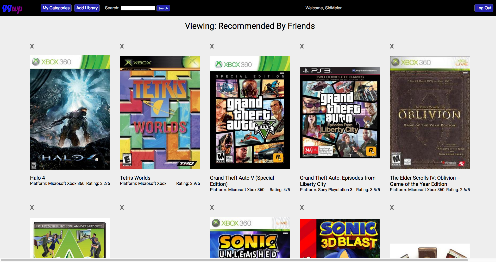

# Good Games

[Good Games live][heroku]

[heroku]: http://www.goodgameswp.us

Good Games is a full-stack web application loosely inspired by Goodreads.  The backend is set up with Ruby on Rails and a PostgreSQL database.  The frontend is handled with React.js using the Redux framework.

## Features & Implementation

Good Games has 5 primary features:
- Games
- Libraries
- Reviews
- Ratings
- Search

### Games

Games are stored in the database with columns for `id`, `title`, `description`, `release_date`, `cover`, and `platform`.  Games can be displayed in one of two primary ways.  The fist is as a `Games Index Item` component which only displays cover art, title, average rating (to be discussed later), and platform.  If a user wants to know more about a game or otherwise interact with it, they can click on the index item to be taken to the game's second view, the `Game Detail` component, which displays all of the database information on the game, as well as user reviews.

There are four types of game indices that users may view.  There is a full index which lists all of the games in the site's database, a user index view which displays all of the games that are in any of the user's libraries, a library detail page which displays all games in the particular library, and a search page which displays all games that match a user inputted query.  All index pages feature hand-rolled **infinite scroll**.

Users may not add or edit games to the database, this privilege is reserved for admins.  However they can review games, rate them, or add them to any of their libraries.

### Libraries

Libraries are a way for users to organize the games in the database into certain categories based on the users' relationship with the game or opinion about them.  Each library has `id`, `user_id`, and `name` columns.  On user creation, three default libraries (`Played`, `To Play`, `Currently Playing`) are made for the user.  These libraries (unlike others) are mutually exclusive and cannot be destroyed.  The user may add games to libraries through the game's detail page.  Games are related to libraries through a `library_links` join table which holds only `id`, `game_id`, and `library_id`.

The user may delete or create new libraries at will using buttons located in the nav bar.  Particular libraries are displayed through a `Library Detail` component which lists all games that have been added to that library.

### Reviews

Reviews are stored in the database with columns for `id`, `user_id`, `game_id`, `title`, and `body`.  Reviews are displayed after the game description on the game detail page reverse order of creation.  Each review displays the name of the user that created it, the title of the review, and the body of the review.

Users can write at most one review of a game, but may edit that review as often as they please.  However, editing a review does not move it up in the index, they remain ordered by newest created.

### Ratings

Each user can rate a game with 1-5 stars. When a user rates a game a row is added to the ratings table, which holds columns for `id`, `user_id`, `game_id`, and `num` which is the actual numerical rating.  A user can only have one rating for a game, but may update it as often as they like.  Whenever the website fetches data for games, it will also fetch all of the ratings information and calculate an average in order to display to the user.  Games may be rated from their detail pages.

The ratings component displayed above was custom made.

### Search

Users may search the database for games that they are interested in or that they want to add to their libraries.  Currently, users may only search by name, and a game's title must include the query exactly in order to match.  

## Future Directions for the Project

In addition to my current work, there are a number of possible improvements that I see for my project.

### Developers/Publishers

I would like to add a table for developers and/or publishers.  This would allow viewers to look at other games made by the same companies, as well as allowing me to display more information about my games.

### Genres

I would also like to add a table for genres and associated join table in order to categorize games into genres.  With this architecture, it wouldn't be that great a leap to add other kinds of tags to the games.

### Better Search

Currently, searches may only be done by game title, and are simply displayed by the order that they were entered into the database.  Ideally, the user would be able to search by any combination of name, genre/tag, platform, or publisher.  Once searched, the user should be able to order their results by alphabet, release date, average rating, platform, or a combination of theses with a user selected priority.

### Related Games

It would be neat if the site kept track of which games have the highest statistical correlation between their ratings and let users known which games were related in this way.
